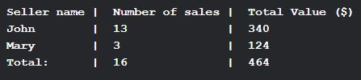

# Coffee For Me

Create a commandline utility that will be used by salesmen and manages of the “CoffeeForMe” company.
 
The script should:

Accept the following commandline arguments:

1.      User name.

2.      User position. (Salesman or Manager are available).

3.      Beverage type. Available for salesmen position only.

4.      Additional beverage ingredients (sugar, cream, cinnamon…). Available for salesmen position only.

5.      Get the beverage price. Available for salesmen position only.

6.      Save the sale details in additional separate bill (file). Available for salesmen position only.

7.      Save the sales details for every salesman (in a database).

8.      Show the summary of all the sales records, in case the utility is started by manager.

See an example of such a summary below:

Though the data can be submitted through commandline arguments, the script must provide additional interactive input.

Handle exceptions for incorrect/invalid arguments and entered values, both for commandline args and in interactive mode.

Some details and requirements may not be covered, use common sense for the program flow creation and document it properly in README.txt file.

Strongly desirable for you to:

1.      Use object-oriented approach.

2.      Preserve Python2 and Python3 compatibility.

3.      Use suitable design patterns, abstractions and common sense.

4.      Write modular reusable code.

5.      Perform extensive logging for every run and every operation during that run.

6.      Provide clear help and usage information.

7.      Comment the code, use docstrings.

8.      Rotate logs the way you consider convenient.

9.      Create unittests for core modules/functions.
